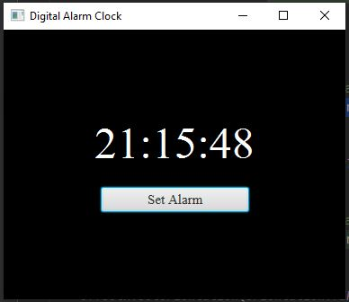
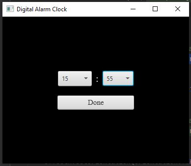

<h2> Digital Clock App with the Scene Graph and Timeline Animation </h2>

<h3> Description </h3>

Create an app that displays a digital clock on the screen in a Label. Include alarm-clock functionality. Use a Timeline animation that executes once per second.

<h3> Software </h3>
<h4>JavaFX SDK 11.0.2 -  https://openjfx.io/  
Scene Builder 11.0.0 - https://gluonhq.com/products/scene-builder/  
IntelliJ IDEA - https://www.jetbrains.com/idea/  
Instruction to set up - https://openjfx.io/openjfx/docs/#introduction   
For VM options: --module-path ${PATH_TO_JAVAFX} --add-modules javafx.controls,javafx.fxml ;${PATH_TO_JAVAFX} - path to JavaFX library </h4>

<h3> App Screenshots </h3>

#

