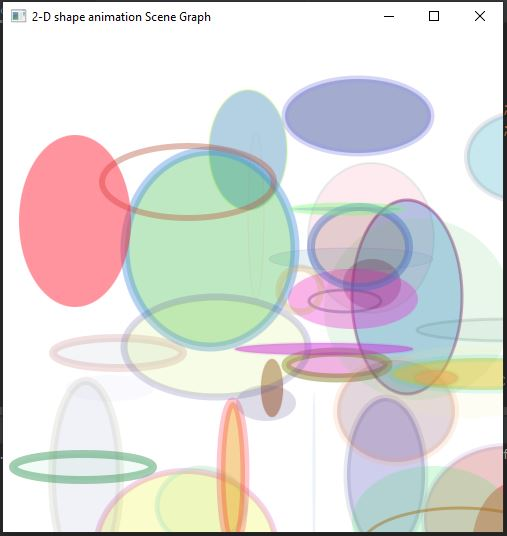

<h2> Random 2D Dynamic Art with Shapes, the Scene Graph and AnimationTimers </h2>

<h3> Description </h3>

Write an app that continuously displays Shape subclass objects on a Pane with random sizes, locations, stroke widths, fills, and alpha transparencies. The Shapes should randomly move around the Canvas in different directions and at different speeds. You’ll need to programmatically create and manipulate the Shapes, then configure their settings similarly to how you specified a GraphicsContext’s settings in Section 22.10. Each Shape you create should have its own AnimationTimer

<h3> Software </h3>
<h4>JavaFX SDK 11.0.2 -  https://openjfx.io/  
Scene Builder 11.0.0 - https://gluonhq.com/products/scene-builder/  
IntelliJ IDEA - https://www.jetbrains.com/idea/  
Instruction to set up - https://openjfx.io/openjfx/docs/#introduction   
For VM options: --module-path ${PATH_TO_JAVAFX} --add-modules javafx.controls,javafx.fxml ;${PATH_TO_JAVAFX} - path to JavaFX library </h4>

<h3> App Screenshots </h3>

