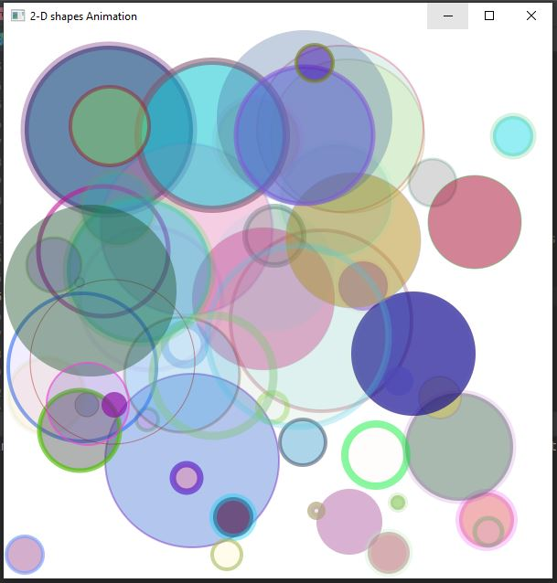

<h2> Random 2D Dynamic Art with Canvas and AnimationTimer </h2>

<h3> Description </h3>

Write an app that continuously draws shapes of your choosing on a Canvas. Use random positions, sizes, locations, line widths, fills, and alpha transparencies. The shapes should randomly move around the Canvas in different directions and at different speeds.

<h3> Software </h3>
<h4>JavaFX SDK 11.0.2 -  https://openjfx.io/  
Scene Builder 11.0.0 - https://gluonhq.com/products/scene-builder/  
IntelliJ IDEA - https://www.jetbrains.com/idea/  
Instruction to set up - https://openjfx.io/openjfx/docs/#introduction   
For VM options: --module-path ${PATH_TO_JAVAFX} --add-modules javafx.controls,javafx.fxml ;${PATH_TO_JAVAFX} - path to JavaFX library </h4>

<h3> App Screenshots </h3>

